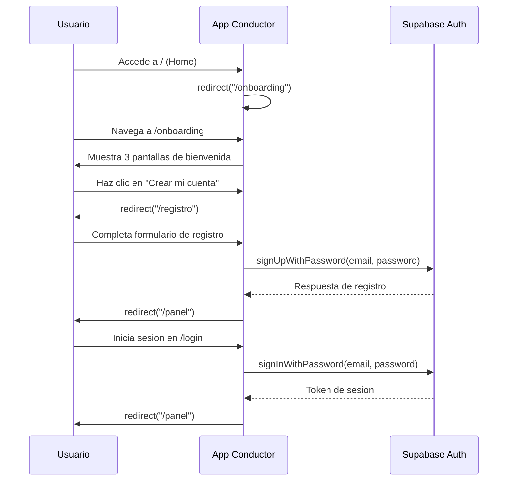
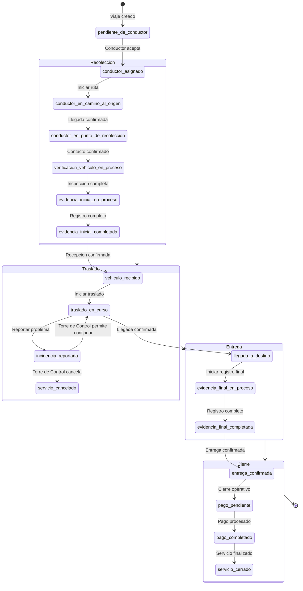

# 📊 Informe de Flujos - Aplicacion Conductor (Ruum)

**Fecha:** 2026-07-18  
**Version:** 1.0  
**Aplicacion:** App Conductor (Next.js 15.1.0)  
**Ubicacion:** `/mnt/c/Users/hmlom/ruum/apps/app-conductor/`

---

## 📋 Resumen Ejecutivo

La aplicacion **App Conductor** es un sistema de gestion de traslados de vehiculos para conductores certificados. Permite a los conductores:
- Visualizar y aceptar viajes disponibles
- Registrar evidencia fotografica del vehiculo (inicial y final)
- Realizar seguimiento en tiempo real
- Gestionar su perfil y documentacion
- Consultar ganancias y historial de viajes

La aplicacion sigue la arquitectura **App Router** de Next.js y utiliza:
- **Supabase** como backend (autenticacion, base de datos en tiempo real)
- **pnpm workspaces** para gestion de dependencias
- **TypeScript** para tipado estatico
- **Tailwind CSS** para estilos

---

## 🎯 Flujo Principal de Usuarios

### Diagrama de Flujo de Navegacion

```
┌─────────────────────────────────────────────────────────────────────────────┐
│                           APP CONDUCTOR                                      │
├─────────────────────────────────────────────────────────────────────────────┤
│                                                                          │
│  ┌─────────────┐     ┌─────────────┐     ┌─────────────────────────────┐  │
│  │   /page.tsx │────▶│ /onboarding/│────▶│          /login             │  │
│  │   (Home)    │     │   page.tsx │     │          page.tsx           │  │
│  └─────────────┘     └─────────────┘     └──────────┬──────────────────┘  │
│                                                      │                  │
│              ┌───────────────────────────────────────┼──────────────────┐  │
│              │                                       │                  │  │
│              ▼                                       ▼                  │  │
│  ┌─────────────────────────────┐    ┌─────────────────────────────┐  │
│  │      /registro/               │    │          /panel/             │  │
│  │      page.tsx                │    │          page.tsx            │  │
│  │ (Registro de conductor)      │    │ (Panel principal)           │  │
│  └─────────────────────────────┘    └──────────┬──────────────────┘  │
│                                                      │                  │
│              ┌───────────────────────────────────────┘                  │
│              │                                                           │
│              ▼                                                           │
│  ┌─────────────────────────────┐                                    │
│  │         /viajes/             │◄───────────────────────────────────┘
│  │         page.tsx             │     ┌─────────────────────────────┐  │
│  │ (Lista de viajes disponibles)│────▶│        /viajes/[id]/         │  │
│  └─────────────────────────────┘     │        page.tsx             │  │
│                                         │ (Detalle del viaje)        │  │
│                                         └──────────┬──────────────────┘  │
│                                                            │                  │
│  ┌─────────────────────────────┐         ┌─────────────────────────────┐  │
│  │        /ganancias/          │◄────────┤                         │  │
│  │        page.tsx             │     │                         │  │
│  │ (Ganancias y pagos)          │     │                         │  │
│  └─────────────────────────────┘     │                         │  │
│                                            │                         │  │
│  ┌─────────────────────────────┐     │                         │  │
│  │        /cuenta/             │◄────────┘                         │  │
│  │        page.tsx             │                                   │  │
│  │ (Configuracion de cuenta)   │───────────────────────────────────┘  │
│  └─────────────────────────────┘                                        │
│                                                                          │
└─────────────────────────────────────────────────────────────────────────────┘
```

---

## 🔄 Flujo de Autenticacion y Onboarding

### Secuencia de Autenticacion



### Estados de Onboarding

1. **Paso 1:** "Tu semana, de un vistazo"
   - Mensaje: "Todos tus viajes y ganancias, en un solo panel"
   - Imagen: Panel del conductor

2. **Paso 2:** "Disponibles, proximos, en curso"
   - Mensaje: "Acepta viajes facilmente"
   - Imagen: Navegacion nocturna

3. **Paso 3:** "Transparencia en cada corte"
   - Mensaje: "Registro del vehiculo que respalda pagos claros"
   - Imagen: Vehiculo con puntos de registro

**Acciones disponibles:**
- `Omitir` -> Redirige a `/login`
- `Ya tengo una cuenta` -> Redirige a `/login`
- `Crear mi cuenta` (en el ultimo paso) -> Redirige a `/registro`

---

## 🚗 Flujo de Vida de un Viaje

### Estados del Traslado (32 estados totales)

La aplicacion maneja los siguientes estados relevantes para el conductor:

#### 📋 Estados Iniciales (Pre-operacion)
| Estado | Descripcion | Accion del Conductor |
|--------|-------------|---------------------|
| `pendiente_de_conductor` | Viaje disponible para asignacion | Ver en lista de disponibles |
| `conductor_asignado` | Conductor asignado al viaje | Iniciar ruta al origen |

#### 🚀 Estados de Recoleccion
| Estado | Descripcion | Accion Principal | Stage |
|--------|-------------|------------------|-------|
| `conductor_en_camino_al_origen` | Conductor en camino | Confirmar llegada | 1 |
| `conductor_en_punto_de_recoleccion` | En punto de recoleccion | Confirmar contacto | 2 |
| `verificacion_vehiculo_en_proceso` | Revisando vehiculo | Iniciar registro inicial | 3 |
| `evidencia_inicial_en_proceso` | Registrando evidencia inicial | Continuar registro | 4 |
| `evidencia_inicial_completada` | Evidencia inicial completa | Confirmar recepcion | 5 |
| `vehiculo_recibido` | Vehiculo recibido | Iniciar traslado | 5 |

#### 🛣️ Estados de Traslado
| Estado | Descripcion | Accion Principal | Stage |
|--------|-------------|------------------|-------|
| `traslado_en_curso` | Vehiculo en movimiento | Confirmar llegada a destino | 5 |
| `incidencia_reportada` | Problema reportado | Esperar decision de Torre de Control | 5 |
| `llegada_a_destino` | Llegada confirmada | Iniciar registro final | 6 |

#### ✅ Estados de Entrega
| Estado | Descripcion | Accion Principal | Stage |
|--------|-------------|------------------|-------|
| `evidencia_final_en_proceso` | Registrando evidencia final | Continuar registro | 6 |
| `evidencia_final_completada` | Evidencia final completa | Confirmar entrega | 7 |
| `entrega_confirmada` | Entrega confirmada | Cerrar viaje | 7 |

#### 💰 Estados de Cierre
| Estado | Descripcion | Accion | Stage |
|--------|-------------|--------|-------|
| `pago_pendiente` | Pago en proceso | Revisar estado | 7 |
| `pago_completado` | Pago completado | Revisar estado | 7 |
| `servicio_cerrado` | Servicio cerrado | Ver historial | 7 |

#### ❌ Estados de Error
| Estado | Descripcion |
|--------|-------------|
| `servicio_cancelado` | Servicio cancelado |
| `traslado_fallido` | Traslado fallido |
| `dano_no_reportado_en_revision` | dano en validacion |
| `reclamo_abierto` | Reclamo abierto |
| `reclamo_resuelto` | Reclamo resuelto |
| `disputa_abierta` | Disputa en curso |
| `disputa_resuelta` | Disputa resuelta |

### Diagrama de Flujo del Viaje



### Acciones por Estado

La aplicacion define un sistema de **presentacion de viajes** en `trip-presentation.ts` que mapea cada estado a:

1. **Stage** (1-7): Paso actual del viaje
2. **Title**: Titulo mostrado al conductor
3. **Instruction**: Instruccion para el conductor
4. **Primary Action**: Accion principal disponible
5. **Secondary Actions**: Acciones secundarias
6. **Next Step**: Proximo paso esperado

#### Ejemplo: Estado `conductor_asignado`
```typescript
{
  stage: 1,
  title: "Dirigete al punto de recoleccion",
  instruction: "Revisa la direccion de recoleccion, abre tu app de navegacion...",
  primaryAction: { label: "Iniciar ruta", action: "go_origin" },
  nextStep: "Al llegar, confirma que encontraste al contacto."
}
```

#### Acciones Principales (TripPresentationAction)

| Accion | Descripcion | Estado Asociado |
|--------|-------------|-----------------|
| `go_origin` | Navegar al origen | `conductor_asignado` |
| `mark_arrived_origin` | Confirmar llegada al origen | `conductor_en_camino_al_origen` |
| `confirm_contact` | Confirmar contacto | `conductor_en_punto_de_recoleccion` |
| `inspect_vehicle` | Inspeccionar vehiculo | `verificacion_vehiculo_en_proceso` |
| `capture_origin_record` | Capturar evidencia inicial | `evidencia_inicial_en_proceso` |
| `confirm_vehicle_received` | Confirmar recepcion | `evidencia_inicial_completada` |
| `start_trip` | Iniciar traslado | `vehiculo_recibido` |
| `go_destination` | Navegar al destino | `traslado_en_curso` |
| `mark_arrived_destination` | Confirmar llegada al destino | `traslado_en_curso` |
| `capture_destination_record` | Capturar evidencia final | `llegada_a_destino`, `evidencia_final_en_proceso` |
| `confirm_delivery` | Confirmar entrega | `evidencia_final_completada` |
| `close_trip` | Cerrar viaje | `entrega_confirmada` |
| `contact_support` | Contactar soporte | `incidencia_reportada` (sin decision) |
| `review_status` | Revisar estado | Estados de cierre |
| `view_available_trips` | Ver viajes disponibles | Estados terminales |
| `none` | Sin accion | Varios estados |

---

## 📱 Flujo de Navegacion y UI

### Componentes Principales de Navegacion

#### 1. **Layout Principal** (`layout.tsx`)
```
┌─────────────────────────────────────────────────────────────┐
│ RootLayout                                                   │
│ ├─ html                                                      │
│ │  ├─ body                                                   │
│ │  │  ├─ ViajeActivoProvider (Context)                      │
│ │  │  │  ├─ SincronizadorEvidenciaOffline                   │
│ │  │  │  ├─ NavegacionConductor                            │
│ │  │  │  └─ children (paginas hijas)                         │
│ │  │  └─ /main                                               │
│ │  └─ #contenido-principal (aria-label)                      │
│ └───────────────────────────────────────────────────────────┘
```

#### 2. **Navegacion** (`NavegacionConductor.tsx`)

**Rutas principales:**
- `/panel` - Inicio (Panel)
- `/viajes` - Viajes
- `/ganancias` - Ganancias
- `/cuenta` - Cuenta

**Comportamiento:**
- Oculto en rutas de autenticacion (`/login`, `/registro`, `/onboarding`)
- Muestra informacion del viaje activo cuando existe
- Version movil: barra inferior con iconos
- Version desktop: barra superior con etiquetas

**Barra de Viaje Activo:**
Cuando hay un viaje activo, muestra:
- Folio del viaje
- Etapa actual
- Destino actual
- Botones rapidos: Abrir, Contacto, Problema, Emergencia

#### 3. **Panel Principal** (`panel/page.tsx`)

**Estados del Panel:**

```
┌─────────────────────────────────────────────────────────────┐
│ Panel                                                           │
├─────────────────────────────────────────────────────────────┤
│                                                               │
│  ┌─────────────────────────────────────────────────────────┐ │
│  │  enRevision:=true                                      │ │
│  │  ┌─────────────────────────────────────────────────┐  │ │
│  │  │  EstadoRevisionConductor                            │  │ │
│  │  │  (Expediente en revision)                           │  │ │
│  │  └─────────────────────────────────────────────────┘  │ │
│  └─────────────────────────────────────────────────────────┘ │
│                                                               │
│  ┌─────────────────────────────────────────────────────────┐ │
│  │  viajeActivoPrincipal: existe                            │ │
│  │  ┌─────────────────────────────────────────────────┐  │ │
│  │  │  PanelActiveTrip                                    │  │ │
│  │  │  (Detalles del viaje activo)                       │  │ │
│  │  └─────────────────────────────────────────────────┘  │ │
│  └─────────────────────────────────────────────────────────┘ │
│                                                               │
│  ┌─────────────────────────────────────────────────────────┐ │
│  │  viajeActivoPrincipal: null                             │ │
│  │  ┌─────────────────────────────────────────────────┐  │ │
│  │  │  PanelHome                                          │  │ │
│  │  │  ├─ DriverAvailabilityControl                       │  │ │
│  │  │  ├─ Resumen de viajes disponibles                   │  │ │
│  │  │  └─ Estadisticas                                     │  │ │
│  │  └─────────────────────────────────────────────────┘  │ │
│  └─────────────────────────────────────────────────────────┘ │
│                                                               │
└─────────────────────────────────────────────────────────────┘
```

---

## 📊 Flujo de Viajes

### Pagina `/viajes`

**Vistas disponibles:**
1. **disponibles** - Viajes disponibles para aceptar
2. **mis-viajes** - Viajes asignados al conductor
3. **historial** - Historico de viajes completados

**Grupos en "mis-viajes":**
- `en-curso` - Viajes en curso
- `proximos` - Proximos viajes
- `por-cerrar` - Viajes pendientes de cierre

**Filtros disponibles:**
- Por fecha: todos, hoy, manana, esta semana, etc.
- Por estado: todos, conductor_asignado, traslado_en_curso, etc.

**Acciones en lista de disponibles:**
- `Aceptar` viaje -> Llama a `aceptarViaje()` API
- `Rechazar` viaje -> Abre dialogo de confirmacion con motivos

**Acciones en lista de mis viajes:**
- `Abrir` detalles -> Navega a `/viajes/[id]`
- `Contacto` -> Muestra informacion de contacto
- `Problema` -> Reportar incidencia
- `Emergencia` -> Panel de emergencia

### Pagina `/viajes/[id]` (Detalle del Viaje)

**Secciones:**
1. **Encabezado** - Folio, paso actual, estado
2. **Acciones Principales** (sticky) - Botones de accion segun estado
3. **Mapa** - Direccion actual (origen o destino)
4. **Informacion de contacto** - Datos del contacto relevante
5. **Vehiculo** - Datos del vehiculo a trasladar
6. **Proximo paso** - Indicacion del siguiente paso
7. **Informacion adicional** (collapsible) - Detalles completos
8. **Soporte** - Reportar incidencia, abrir disputa, emergencia
9. **Chat** - Chat del viaje

**Acciones segun estado:**
- `go_origin` -> Abre app de navegacion
- `mark_arrived_origin` -> Confirma llegada
- `confirm_contact` -> Confirma contacto
- `inspect_vehicle` -> Abre registro de inspeccion
- `capture_origin_record` -> Abre camara para evidencia
- `confirm_vehicle_received` -> Confirma recepcion
- `start_trip` -> Inicia traslado
- `mark_arrived_destination` -> Confirma llegada a destino
- `capture_destination_record` -> Abre camara para evidencia final
- `confirm_delivery` -> Confirma entrega
- `close_trip` -> Cierra viaje

---

## 💰 Flujo de Ganancias

### Pagina `/ganancias`

**Resumen mostrado:**
- Vehiculos trasladados (contador)
- Ganancias generadas
- Gastos autorizados
- Ajustes
- Retenciones
- Deposito final

**Secciones:**

1. **Resumen semanal**
   - Ganancias generadas
   - Gastos registrados y autorizados
   - Ajustes o retenciones
   - Deposito final
   - Fecha de pago
   - Metodo de pago

2. **Historial de pagos**
   - Lista de periodos de pago
   - Estado de cada pago: sin_calcular, estimado, en_validacion, confirmado, programado, pagado, retenido, rechazado
   - Monto generado
   - Gastos autorizados
   - Fecha de liberacion

**Estados economicos:**
- `sin_calcular` - Sin calcular
- `estimado` - Estimado
- `en_validacion` - En validacion
- `confirmado` - Confirmado
- `programado` - Programado
- `pagado` - Pagado
- `retenido` - Retenido
- `rechazado` - Rechazado

---

## 👤 Flujo de Cuenta

### Pagina `/cuenta`

**Secciones principales:**

| Seccion | Ruta | Descripcion |
|---------|------|-------------|
| Perfil | `/cuenta/perfil` | Datos personales, direccion, contacto de emergencia |
| Documentos | `/cuenta/documentos` | Expediente operativo, carga de archivos |
| Preferencias | `/cuenta/preferencias` | Notificaciones, tipos de viaje |
| Datos Bancarios | `/cuenta/datos-bancarios` | Cuenta para depositos, validacion |
| Seguridad | `/cuenta/seguridad` | Contraseña, sesion, cambios sensibles |
| Soporte | `/cuenta/soporte` | Canales oficiales, baja de cuenta |
| Legal | `/cuenta/legal` | Terminos y aviso de privacidad |

### Documentos Requeridos

El sistema usa `DriverDocumentChecklist.tsx` para gestionar la lista de documentos requeridos para el conductor.

---

## 🛠️ Componentes Clave

### Contextos (State Management)

1. **ViajeActivoContext** (`ViajeActivoContext.tsx`)
   - Gestiona el viaje activo del conductor
   - Proporciona: `viajeActivo`, `viajeActivoSinActualizar`, `registrarViajeActivo`
   - Usa: `useActiveTripSubscription` (suscripcion en tiempo real)
   - Usa: `useDriverLocationTracking` (seguimiento de ubicacion)

2. **Panel Data** (`panel/usePanelData.ts`)
   - Obtiene datos del conductor
   - Obtiene disponibilidad
   - Obtiene viajes disponibles
   - Obtiene viaje activo
   - Obtiene proximo viaje
   - Obtiene documento bloqueante

### Hooks Personalizados

1. **useActiveTripSubscription** - Suscripcion a viajes activos en tiempo real
2. **useDriverLocationTracking** - Seguimiento de ubicacion del conductor
3. **usePanelData** - Datos del panel principal
4. **useViajeActivo** - Acceso al contexto de viaje activo

### Utilidades

1. **trip-presentation.ts** - Presentacion de estados de viaje
2. **active-trip-state.ts** - Estados y utilidades de viaje activo
3. **trips-utils.ts** - Utilidades para listado de viajes
4. **supabase-browser.ts** - Cliente de Supabase para navegador
5. **supabase-server.ts** - Cliente de Supabase para servidor

---

## 🔌 Integraciones Externas

### Supabase

**Tabla principal:** `traslados`

**Columnas relevantes:**
- `id` - UUID del traslado
- `estado` - Estado actual (enum estado_traslado)
- `origen_direccion`, `origen_ciudad`, `origen_lat`, `origen_lng` - Origen
- `destino_direccion`, `destino_ciudad`, `destino_lat`, `destino_lng` - Destino
- `vehiculo_marca`, `vehiculo_modelo`, `vehiculo_anio`, `vehiculo_color`, `vehiculo_placas` - Vehiculo
- `contacto_entrega_nombre`, `contacto_entrega_telefono` - Contacto de entrega
- `contacto_recepcion_nombre`, `contacto_recepcion_telefono` - Contacto de recepcion
- `evidencia_inicial_fotos_sincronizadas` - Count de fotos iniciales
- `evidencia_final_fotos_sincronizadas` - Count de fotos finales
- `actualizado_en` - Timestamp de ultima actualizacion

**Vista:** `pasaporte_digital` - Vista que consolida informacion del traslado para el conductor

### API Services

**Funciones principales:**
- `obtenerPasaporteDigital()` - Obtiene datos del viaje
- `listarViajesDisponibles()` - Lista viajes disponibles
- `listarViajesAceptados()` - Lista viajes aceptados por el conductor
- `listarHistorialViajesConductor()` - Lista historial de viajes
- `aceptarViaje()` - Acepta un viaje
- `registrarEvento()` - Registra eventos del viaje
- `obtenerConductorActual()` - Obtiene datos del conductor
- `obtenerGananciasConductor()` - Obtiene ganancias del conductor

---

## 📊 Metricas y Estadisticas

### Estadisticas en el Panel

- Viajes en curso
- Proximos viajes
- Viajes por cerrar
- Viajes disponibles
- Viajes en historial

### Indices de Rendimiento

- Calificacion promedio del conductor
- Traslados completados
- Suspensiones activas
- No presentaciones (ultimos 6 meses)
- Cancelaciones sin justificacion
- Incidencias graves (ultimos 6 y 12 meses)

---

## 🎨 Experiencia de Usuario (UX)

### Patrones de Diseño

1. **Navegacion consistente** - Barra de navegacion presente en todas las paginas (excepto autenticacion)
2. **Viaje activo persistente** - Informacion del viaje activo siempre visible
3. **Feedback visual** - Estados claros con colores y badges
4. **Acciones contextuales** - Botones que cambian segun el estado del viaje
5. **Hot reload** - Cambios en el codigo se reflejan sin reiniciar (en desarrollo)

### Accesibilidad

La aplicacion incluye:
- Etiquetas ARIA apropiadas
- Skip links para navegacion con teclado
- Contrastes de color adecuados
- Textos descriptivos en imagenes
- Auditaron de accesibilidad (AUDITORIA_ACCESIBILIDAD.md)

---

## 🔒 Flujo de Seguridad

### Autenticacion

1. **Inicio de sesion** - `/login`
   - Validacion de credenciales
   - Persistencia de sesion con Supabase
   - Redireccion a `/panel` o `/onboarding` (si es primer acceso)

2. **Cierre de sesion**
   - Elimina token de sesion
   - Limpia borrador de registro local
   - Redirige a `/onboarding`

3. **Proteccion de rutas**
   - Rutas de autenticacion ocultan navegacion
   - Rutas protegidas redirigen a `/login` si no hay sesion

### Validaciones

1. **Validacion de documentos** - Antes de aceptar viajes
2. **Validacion de disponibilidad** - Conductor debe estar disponible
3. **Validacion de ubicacion** - Permisos de geolocalizacion
4. **Validacion de evidencia** - Fotos requeridas completas

---

## 📁 Estructura de Archivos Relevantes

```
app-conductor/
├── src/
│   └── app/
│       ├── layout.tsx              # Layout principal
│       ├── page.tsx                # Home (redirige a /onboarding)
│       ├── NavegacionConductor.tsx # Componente de navegacion
│       ├── ViajeActivoContext.tsx  # Contexto de viaje activo
│       ├── active-trip-state.ts     # Estados de viaje activo
│       ├── 
│       ├── auth/
│       │   └── callback/
│       │       └── route.ts        # Callback de autenticacion
│       │
│       ├── panel/
│       │   ├── page.tsx            # Panel principal
│       │   ├── PanelHome.tsx        # Home del panel
│       │   ├── PanelActiveTrip.tsx  # Viaje activo en panel
│       │   ├── usePanelData.ts       # Hook de datos del panel
│       │   └── ...
│       │
│       ├── viajes/
│       │   ├── page.tsx            # Lista de viajes
│       │   ├── [id]/
│       │   │   └── page.tsx        # Detalle del viaje
│       │   ├── TripOpportunityList.tsx
│       │   ├── DriverTripsList.tsx
│       │   ├── TripHistoryList.tsx
│       │   └── trips-utils.ts       # Utilidades de viajes
│       │
│       ├── ganancias/
│       │   └── page.tsx            # Pagina de ganancias
│       │
│       ├── cuenta/
│       │   ├── page.tsx            # Indice de cuenta
│       │   ├── perfil/
│       │   ├── documentos/
│       │   ├── preferencias/
│       │   ├── datos-bancarios/
│       │   ├── seguridad/
│       │   ├── soporte/
│       │   └── legal/
│       │
│       ├── registro/                # Flujo de registro
│       ├── login/                  # Inicio de sesion
│       ├── onboarding/              # Bienvenida
│       └── ...
│
└── lib/
    ├── supabase-browser.ts        # Cliente Supabase (navegador)
    ├── supabase-server.ts         # Cliente Supabase (servidor)
    ├── trip-presentation.ts       # Presentacion de estados
    ├── ubicacion.ts               # Utilidades de ubicacion
    └── ...
```

---

## 📈 Resumen de Flujos Criticos

### 1. Flujo de Primer Uso
```
Iniciar App → / → /onboarding → /registro → /panel
```

### 2. Flujo de Login
```
/login → Autenticacion → /panel
```

### 3. Flujo de Aceptar Viaje
```
/panel → /viajes → Ver lista → Aceptar → /viajes/[id] → Realizar acciones
```

### 4. Flujo Completo de Viaje
```
conductor_asignado → conductor_en_camino_al_origen → conductor_en_punto_de_recoleccion → 
verificacion_vehiculo_en_proceso → evidencia_inicial_en_proceso → evidencia_inicial_completada → 
vehiculo_recibido → traslado_en_curso → llegada_a_destino → evidencia_final_en_proceso → 
evidencia_final_completada → entrega_confirmada → pago_pendiente → pago_completado → servicio_cerrado
```

### 5. Flujo de Emergencia
```
Cualquier estado operativo → Reportar problema → incidencia_reportada → 
Esperar decision de Torre de Control → Continuar o Cancelar
```

---

## 🔍 Puntos de Extension

1. **Nuevos estados de viaje** - Agregar casos en `trip-presentation.ts`
2. **Nuevas acciones** - Extender `TripPresentationAction`
3. **Nuevos tipos de evidencia** - Modificar `evidence-requirements.ts`
4. **Nuevos filtros** - Extender `trips-utils.ts`
5. **Nuevas secciones de cuenta** - Agregar rutas en `/cuenta/`

---

## 📝 Documentacion Relacionada

- [README.md](apps/app-conductor/README.md) - Documentacion principal
- [AUDITORIA_ACCESIBILIDAD.md](apps/app-conductor/AUDITORIA_ACCESIBILIDAD.md) - Auditoría de accesibilidad
- [CORRECCIONES_ACCESIBILIDAD.md](apps/app-conductor/CORRECCIONES_ACCESIBILIDAD.md) - Correcciones de accesibilidad
- [DOCKER_README.md](../DOCKER_README.md) - Configuracion de Docker

---

## 🏷️ Tecnologias Utilizadas

| Tecnologia | Version | Uso |
|------------|---------|-----|
| Next.js | 15.1.0 | Framework principal |
| React | 19.0.0 | Biblioteca de UI |
| TypeScript | 5.7.2 | Tipado estatico |
| Supabase | 2.47.0 | Backend (Auth + DB) |
| Tailwind CSS | 4.0.0 | Estilos |
| pnpm | 10.0.0 | Gestion de paquetes |
| Capacitor | 8.4.1 | Compilacion a app movil |
| Playwright | 1.51.1 | Testing E2E |
| ESLint | 9.39.4 | Linting |

---

*Generado el 2026-07-18 | App Conductor - Ruum*