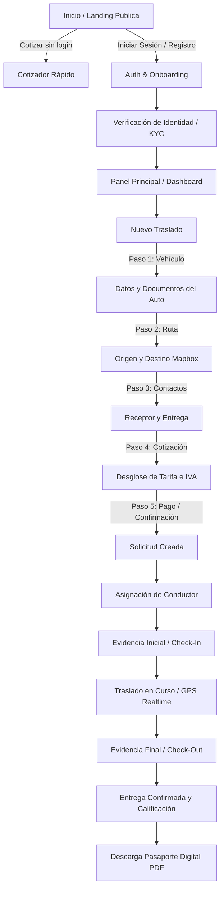
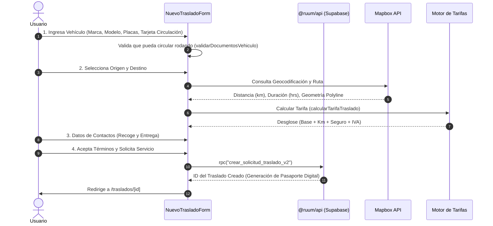

# INFORME DETALLADO DE FLUJOS — APP USUARIO (RUUM RUUM)

**Fecha de Emisión:** 23 de Agosto de 2026  
**Versión del Sistema:** 1.0.0 (Producción / Release Candidate)  
**Aplicación:** `@ruum/app-usuario`  
**Stack Tecnológico:** Next.js 15.5.23 (App Router) + React 19 + TypeScript + Supabase + Mapbox GL + Stripe  

---

## 1. RESUMEN EJECUTIVO Y MAPA GENERAL DE LA APLICACIÓN

La aplicación **Ruum Ruum Usuario** (`app-usuario`) es la plataforma central orientada a los clientes finales y empresas que requieren servicios de traslado rodando de vehículos bajo el modelo de **Pasaporte Digital**.

La experiencia cubre el ciclo de vida completo de un traslado:
1. **Descubrimiento y Cotización Pública** (sin fricción inicial).
2. **Autenticación y Verificación de Identidad** (cumplimiento regulatorio y seguridad).
3. **Configuración y Solicitud del Traslado** (formulario guiado multipaso).
4. **Asignación, Despacho y Monitoreo en Tiempo Real** (telemetría GPS + Realtime).
5. **Inspección Digital de Evidencia** (fotografías 360°, check-in y check-out).
6. **Pasarela de Pago Seguro y Facturación** (Stripe + CFDI 4.0).
7. **Resolución de Incidencias, Chat y Calificación Operativa**.



---

## 2. DETALLE PASO A PASO DE LOS FLUJOS PRINCIPALES

---

### FLUJO 1: DESCUBRIMIENTO, REGISTRO Y AUTENTICACIÓN

#### 1.1. Modo Público y Cotizador Exprés (`/`)
* **Propósito:** Permitir a visitantes calcular el costo de un traslado sin obligarlos a registrarse previamente.
* **Componentes clave:** `InicioUsuario.tsx`, `experiencia-publica.tsx`, `SkeletonMapa.tsx`.
* **Entradas:**
  * Dirección o ciudad de origen y destino.
  * Tipo de vehículo (Sedán, SUV, Pickup, Premium, Eléctrico).
  * Fecha tentativa del traslado.
* **Salidas y Comportamiento:**
  * Cálculo dinámico de distancia y tiempo estimado mediante la API de Mapbox Directions.
  * Estimación de tarifa con base en la matriz de precios (`tarifa base + precio por km`).
  * Botón de llamada a la acción (*CTA*): *"Solicitar Traslado"* redirige a `/registro` o `/traslados/nuevo` conservando el estado en memoria o query params.

#### 1.2. Registro de Usuario (`/registro`)
* **Ruta:** `/registro/page.tsx`
* **Campos Requeridos:** Nombre completo, correo electrónico, teléfono (10 dígitos en formato E.164), contraseña.
* **Reglas de Negocio:**
  * Validación estricta de fortaleza de contraseña: mínimo 8 caracteres, al menos 1 mayúscula, 1 número y 1 caracter especial (`@ruum/shared/utils/requisitos-password`).
  * Verificación de duplicidad de correo en Supabase Auth.
* **Resultado:** Creación de registro en la tabla `usuarios` y envío de token de validación.

#### 1.3. Inicio de Sesión y Recuperación (`/login`, `/recuperar-password`, `/nueva-password`)
* **Inicio de Sesión:** Soporta autenticación mediante Email/Contraseña y enlace mágico (*Magic Link*).
* **Manejo de Redirección:** Parámetro `?next=/traslados/nuevo` preserva la intención del usuario.
* **Recuperación de Contraseña:**
  1. Solicitud de reset en `/recuperar-password`.
  2. Recepción de correo con link seguro temporal.
  3. Redirección a `/auth/callback` con intercambio de token PKCE.
  4. Establecimiento de nueva clave en `/nueva-password`.

---

### FLUJO 2: VERIFICACIÓN DE IDENTIDAD Y EXPEDIENTE (`/verificacion`)

Para garantizar la seguridad de los vehículos de alto valor y mitigar riesgos de fraude:

* **Componentes:** `VerificacionForm.tsx`, `page.tsx`.
* **Pasos del Expediente:**
  1. **Documento de Identidad Oficial:** Carga de INE/Pasaporte (frente y reverso).
  2. **Comprobante de Domicilio:** Validación de antigüedad no mayor a 3 meses.
  3. **Verificación Biométrica:** Integración con motor Didit (liveness test y face-matching).
* **Estados de Verificación:**
  * `usuario_pendiente_verificacion`: En cola de revisión manual o automatizada.
  * `usuario_verificado`: Habilita la contratación de traslados interestatales y premium.

---

### FLUJO 3: CREACIÓN Y SOLICITUD DE TRASLADO (`/traslados/nuevo`)

El núcleo operativo de la aplicación. Se implementa como un formulario reactivo multipaso (`NuevoTrasladoForm.tsx`) con guardado de borrador automático:



#### Reglas de Validación en la Creación:
* **Condición de Rodaje:** Si el vehículo no puede circular rodando por avería mayor, la plataforma restringe el servicio y ofrece alternativas (ej. grúa o soporte especializado).
* **Documentación Mínima:** Tarjeta de circulación vigente o permiso especial de traslado.
* **Geocercas y Destinos Seguros:** Verificación mediante `validarDestinoSeguro` para evitar zonas de riesgo restringidas por pólizas de seguro.

---

### FLUJO 4: PASAPORTE DIGITAL Y SEGUIMIENTO EN TIEMPO REAL (`/traslados/[id]`)

La pantalla más rica en interacción de la app. Gestiona los cambios de estado en tiempo real.

```
┌────────────────────────────────────────────────────────┐
│              PASAPORTE DIGITAL DE TRASLADO             │
│  ID: TRAS-89421-CDMX                                   │
│  Vehículo: Mazda 3 Sedan 2023 · Placas: ABC-123-D      │
│  Estado Actual: [ TRASLADO EN CURSO ]                  │
├────────────────────────────────────────────────────────┤
│ [ Pestaña: Ruta ] [ Pestaña: Evidencia ] [ Chat ]      │
│                                                        │
│  🗺️ MAPA EN VIVO (Mapbox GL):                          │
│  ● CDMX (Origen) ────► 🚗 (Km 142) ────► ● GDL (Dest.) │
│  Velocidad: 85 km/h · ETA: 16:45 hrs                   │
│                                                        │
│  📸 EVIDENCIA FOTOGRÁFICA DE RECEPCIÓN:                │
│  [ Frente: OK ] [ Lateral Izq: OK ] [ Odómetro: 15,200]│
│                                                        │
│  👤 CONDUCTOR CERTIFICADO:                             │
│  Roberto Gómez ★ 4.98 (124 viajes) · Tel: [ Llamar ]   │
└────────────────────────────────────────────────────────┘
```

#### Sub-componentes y Capacidades:
1. **Seguimiento GPS (`SeguimientoTrasladoTiempoReal.tsx`):**
   * Suscripción WebSocket a canales `realtime:ubicaciones_traslado`.
   * Actualización del marcador del auto con interpolación suave de coordenadas.
2. **Inspección Comparativa (`PasaporteTabs.tsx`):**
   * Visualizador de fotos de Check-in (origen) vs Check-out (destino) para verificar que el auto se entregue en idénticas condiciones estéticas y mecánicas.
3. **Chat Seguro con el Conductor (`ChatTraslado.tsx`):**
   * Mensajería instantánea dentro de la app sin exponer datos personales ni requerir apps de terceros.
4. **Botón de Emergencia y Reporte de Incidencias (`ReportarIncidencia.tsx`):**
   * Envío de alertas prioritarias en caso de avería, pinchadura, retén o retraso mayor.
5. **Gestión de Disputas (`AbrirDisputa.tsx`):**
   * Procedimiento formal ante inconformidades de cobro o daños no reportados con SLA de respuesta máximo de 24 horas.

---

### FLUJO 5: PAGOS Y TRANSACCIONES (`PagoStripe.tsx` / `PagoTraslado.tsx`)

* **Métodos Soportados:** Tarjetas de Crédito/Débito (Visa, Mastercard, AMEX), transferencias SPEI.
* **Modelo de Retención:**
  * Al confirmar la cotización, se realiza una **retención (hold)** en la tarjeta.
  * El cobro se liquida automáticamente una vez completada la entrega y validada la evidencia final sin disputas.
* **Recuperabilidad (`PagoRecuperable.tsx`):** Si una tarjeta es declinada, se notifica al usuario con opción de actualizar la forma de pago sin cancelar la orden de traslado.

---

### FLUJO 6: HISTORIAL, GESTIÓN DE CUENTA Y POST-VENTA

* **Mis Viajes (`/mis-viajes`):**
  * Pestañas: **Activos**, **Programados**, **Finalizados** y **Cancelados**.
  * Acceso directo al Pasaporte Digital de cada servicio.
* **Exportación de Pasaporte Digital (`ExportarPasaportePdf.tsx`):**
  * Generación de certificado PDF descargable con sello de tiempo, bitácora de telemetría, firma del conductor y expediente fotográfico.
* **Calificación (`CalificarTraslado.tsx`):**
  * Evaluación de 1 a 5 estrellas con tags de retroalimentación (Cuidado del auto, Puntualidad, Comunicación).
* **Gestión de Perfil y Facturación (`/cuenta`):**
  * Datos fiscales (RFC, Razón Social, Régimen Fiscal, Código Postal) para emisión automática de factura CFDI 4.0.

---

## 3. MATRIZ DE ESTADOS Y TRANSICIONES (MÁQUINA DE ESTADOS)

| Estado Interno | Etiqueta al Usuario | Acciones Disponibles |
| :--- | :--- | :--- |
| `solicitud_creada` | Solicitud recibida | Cancelar, editar datos de contacto |
| `documentacion_en_revision` | En preparación | Cargar documentos faltantes |
| `cotizacion_aceptada` | Pago pendiente | Ingresar método de pago / Confirmar |
| `conductor_asignado` | Conductor asignado | Ver perfil del conductor, abrir chat |
| `conductor_en_camino_al_origen` | Conductor en camino | Ver ruta de aproximación |
| `verificacion_vehiculo_en_proceso` | Recolección en proceso | Monitorear fotos de inspección inicial |
| `traslado_en_curso` | En camino | Ver telemetría en vivo, velocidad y ETA |
| `llegada_a_destino` | Llegando a destino | Notificar al receptor |
| `evidencia_final_en_proceso` | Entrega en proceso | Validar fotos de entrega |
| `entrega_confirmada` | Entregado | Calificar servicio, solicitar factura |
| `servicio_cerrado` | Viaje finalizado | Descargar Pasaporte PDF |
| `disputa_abierta` | Disputa abierta | Adjuntar pruebas a soporte |

---

## 4. CONSIDERACIONES DE SEGURIDAD Y PRIVACIDAD

1. **Enmascaramiento de Datos Sensibles:** Los números de teléfono de contacto y referencias bancarias se ofuscan en pantalla (`enmascararUltimos`).
2. **Fail-Closed Security:** Protección de rutas protegidas mediante middleware Next.js que redirige usuarios no autenticados a `/login`.
3. **CSP Estricto:** Cabeceras HTTP que impiden inyecciones XSS, Clickjacking y limitan conexiones externas únicamente a Supabase, Stripe y Mapbox.

---

## 5. CONCLUSIÓN

La aplicación **Ruum Ruum Usuario** provee un ecosistema cerrado, confiable y transparente para la gestión de traslados vehiculares. La combinación del **Pasaporte Digital**, la **verificación biométrica** y el **seguimiento GPS en vivo** resuelve las principales fricciones del mercado tradicional de logística y traslado automotriz en México.
